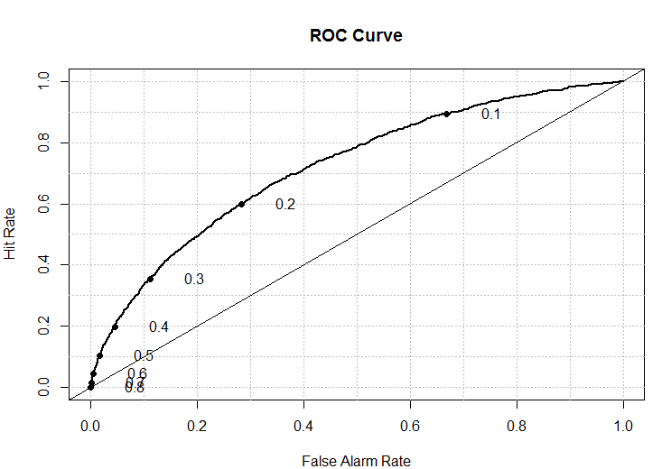
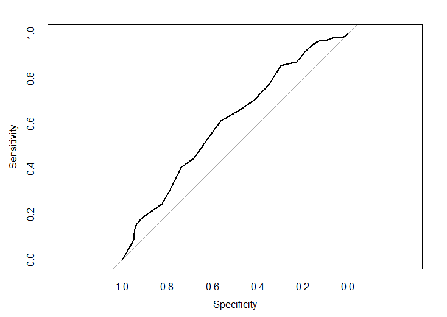

## Overview of the problem

Any loan that is not paid back by the lender is a significant source of worries to the company.

But upon making the loan application, we are already collecting substantial number of information that is usually evaluated by the loan officer, but people can sometimes be biased or overlook statistically significant information.

Hence we can investigate whether the loans we have done in the past and their actual outcome (observed) to make smarter loans in the future.

# This is a well studied problem. 

But it is also vital, we estimate that the savings could be around $350,000--based on the average loan size for the "uncreditworthy" loans and the performance of our model at a set threshold (to be explained later).


--- .class #id 

## Business proposition

If we can succesfully identify bad loans and not give them out, then we can substantially _decrease_ the interest good borrowers are paying and _increase_ profits. Just by _identifying the right borrowers based on data we already collect_.

Challenges:
* How accurate can the model be?
* How risk averse do we want to be when we could take on a potentially bad lender?
* Can we make still the model simple enough to be understandable? (i.e., interpretable)

# Next couple of slides will be somewhat technical. 

---

## The solution

The answer to the last question is yes: this problem calls for a logistic regression, which has coefficients that can be interpreted by a skilled analyst as odds ratios. (However, explaining that in depth is beyond the scope of this presentation, but it can be easily done.)

Logistic regression is usually represented as follows:
$$
\LARGE F(X) = \frac{e^{-\beta * X}}{1+e^{-\beta * X}}
$$

Where ${\LARGE \beta}$ are fitted parameters and ${\LARGE X}$ is the matrix with the data. The fitted parameters relate to specific variables. So it is possible to train the loan officer to gain--at least inituitive--understanding of the process.

For instance, the officer should be to understand that we are rejecting/accepting this applicant, because this combination of credit history, state and income are very un/likely to pay the loan back. 

---

## Application

So we took the logistic regression and applied it to the data. Couple of things to note here:

* We 10-fold cross-validated the parameters to avoid overfitting.
* We dropped the 62 observations, where there were missing data (out of original 24776).
* We penalized the logistic regression using a regularization term to mitigate overfitting.
* We split the data into a 70% training set and 30% test set.

# Hence we are confident that our results will generalise well.


If desired, for a more detailed exposition of the data plaese follow <a href="https://www.dropbox.com/s/w1kgegtvcpqp5t9/Programing_Project.pdf?dl=0"> this link</a>.

---

## The metrics

As you know, there are many ways to evaluate a model, we will present:

1. Confusion Matrix
  * Includes recall (aka sensitivity), Cohen's kappa, Accuracy and other useful metrics
  * Gives us confidence intervals assuming that the distribution of borrowers will not change (it might, however) of how well we can expect the model to generalise.
  * However, confusion matrix relies on specifying an arbitrary threshold--we picked 0.5.
2. Reciever Operator Curves (ROC) 
3. Gini Coefficient 
4. Area Under the Curve (AUC)

All of these evaulate the models in somewhat different ways and some--like gini index or AUC--give us an indication of the model quality regardless of how risk averse we are. In other words, they tell us how good a model is even if we do not specify a threshold for what levels of risk and exposure we are willing to accept.

---

## Confusion Matrix and Statistics

<center>

```r
Prediction       Creditworthy Uncreditworthy
  Creditworthy           6047           1311
  Uncreditworthy           25             33
                                          
               Accuracy : 0.8198          
                 95% CI : (0.8109, 0.8285)
    No Information Rate : 0.8188          
    P-Value [Acc > NIR] : 0.4118          
                                          
                  Kappa : 0.0326          
 Mcnemar's Test P-Value : <2e-16          
                                          
            Sensitivity : 0.99588         
            Specificity : 0.02455         
         Pos Pred Value : 0.82183         
         Neg Pred Value : 0.56897                

```
</center>

---

## ROC Curve


<div align='center'>

</div>

---

## Gini coefficient 

The following two metrics do not rely on the threshold (which you can specify in any way suits your business), but rather give an idea of overall model quality, though this is still highly domain dependent.

# What does it mean?
Technically "represents a multiplicative increase in the positive class's rate (due to a given predictive model) over a random guess", which I find highly confusing, but this measure is commonly used in economics so might give you an intuitive understanding of model performance.

### Our gini coefficient is 0.3708389.

It is mathematically related, but--at least for me--much less intuitive than Area Under the Curve.

<div align='center'>

</div>

---

## Area Under the Curve (AUC)
This is much more inutitive: when we plot our classifier as a function of specificity (a perfect classifier would be going along the corners of the rectangle), we get some bow-shaped (ish) curve that tells us how well can our model predict, given a certain threshold. We then integrate the area and should get a metric that is larger than .5 (a guess). However, this measure is best used only to compare two models between themselves, I highly recommend using confusion matrix with a set of thresholds to get a better understanding of what this means.

Our AUC is 0.5265.

--- 

## So now what?

<center>


</center>

So what does this really mean? 

----

## Technical Summary

The two classes are heavily skewed in favour of good borrowers, so the pre-screening seems to work at least somewhat.

As a result, the model can have a hard time identifying bad borrowers. But a reasonably conservative model can still deliver a noticable marginal improvement over just human judgement. Though we certainly advocate for both. 

Overall, our model with the threshold set at 0.5 (basically our model prediction of probability of being good borrower) would screen out additional loan applicatns at a cost of more than halving the number of bad borrowers. 

### Whether this is an ideal threshold for you is a busines decision, but the threshold can be tuned to fit your needs.

---

## Wrap-up and business implications


Our model performs well, but it all depends on threshold, as already there is considerable degree of pre-screening and most loans ended up being quite good.

Our model can deliver additional value, but needs to be evaluated as a finacial venture, especially with regards to the marginal improvement that can be gained by setting the threshold at a certain level.

The code is available on demand to help you implement this in production. (However, we would recommend also including some GUI so that this can be used by loan officers on the spot).

The estimated savings could be even larger than estimated and it is interesting to note that the 'uncreditworthy class' has asked for more, on average, than the 'creditworthy' borrowers.

But ultimately, a field test is the only certain way to ensure that this is a noticable improvement over just human judgement.

---

## Questions?
